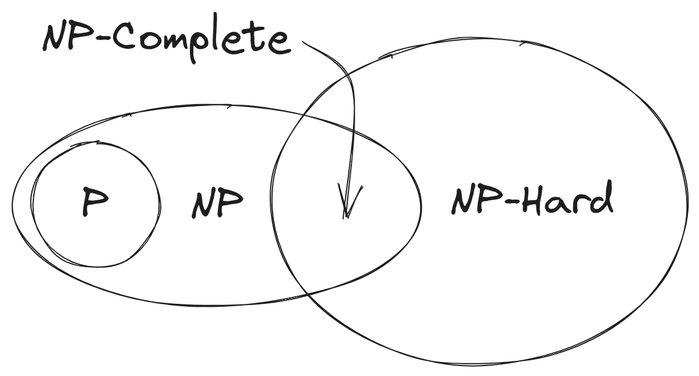
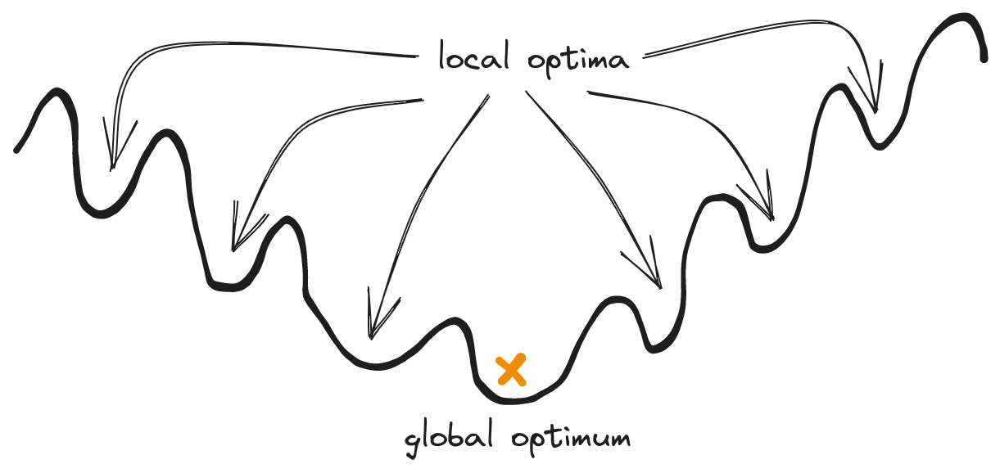
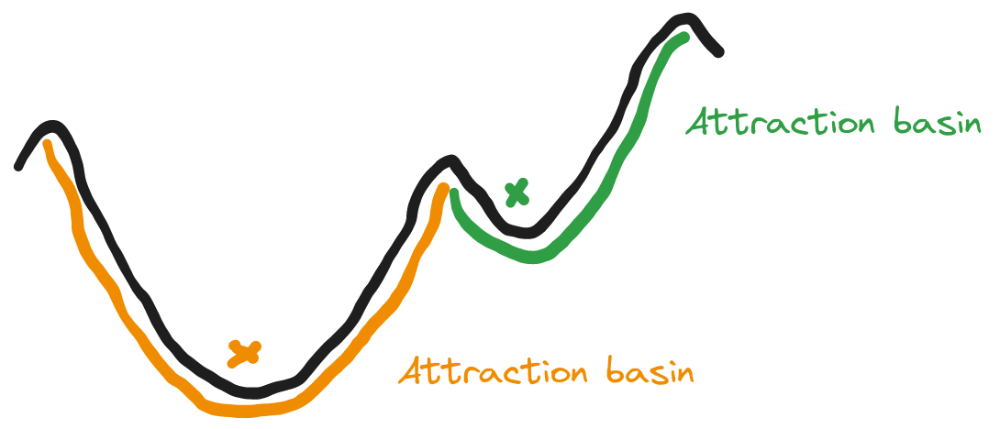

% Introduction to Metaheuristics
% DrC. Alejandro Piad Morffis
% CC-BY - matcom.in/metaheuristics

# Why optimization is hard

**What is the hardest problem you can think of?**

# Why optimization is hard

**Some hard problems:**

- Knapsack
- Scheduling
- Bin packing
- Vehicle routing
- Travelling salesman
- ...

. . .

**What do they have in common?**

. . .

We don't know any polynomial algorithm to solve them.

# Recap on Complexity Theory

**Problems in P**: Decision problem, decidable with a polynomial-time algorithm.

. . .

**Problems in NP**: Decision problem, verifiable with a polynomial-time algorithm.

. . .

**The fundamental problem in Complexity Theory**

Is P = NP?

# Recap on Complexity Theory

A problem A is polynomially-reducible to another problem B iff

- Given an input for A, we can build a input for B in polynomial time
- Given an output for B, we can build an output for A in polynomial time

Thus, if B has a polynomial-time algorithm, so does A.

This implies, if we knew A had no polynomial time algorithm, neither does B.

_NOTE: This is not restricted to decision problems_

# Recap on Complexity Theory

**Question**: Is there any problem T such that all problems in NP are polynomially reducible to T?

First, think, what would imply for a such a problem to exist?

. . .

This is called an **NP-Hard** problem.

If you solve it in polynomial time, then you solve all NP problems in polynomial time.

Notice there has to be NP-Hard problems! Can you think of one?

_NOTE: NP-Hard problems need not be decision problems_

# Recap on Complexity Theory

**Question**: Is there any NP-Hard problem that is also in NP?

What would that imply?

. . .

This is called an **NP-Complete** problem.

If we find one, this means there are problems in NP as hard as any decision problem (verifiable in polynomial time).

It this a strong evidence that P != NP? Why?

# Recap on Complexity Theory

The first ever problem proven NP-Complete is **Circuit SAT**, but there are many more.

Basically all decision version of NP-Hard optimization problems:

- Is there a tour with less than X cost?
- Is there a packing with less than X area?
- Is there a schedule finishing in less than X time?
- ...

# Recap on Complexity Theory

**If P != NP, this is the panorama:**

# Why is optimization hard

Even is P = NP, NP-Hard problems will still exist!

- Combinatorial optimization is **NP-Hard**.
- Continuous optimization is **at least as hard**. (Why?)

(But P probably != NP, anyway...)

# Why optimization is hard

## Multiple local optima

**How do you even know you found the optimum?**

# Why optimization is hard

**Other reasons:**

- Weak global structure.
- Disparate attraction basins.
- And most real-life functions are **black-box** anyway, exact gradients are not available.

# What can we do

. . .

**Just search, but with common sense!**

- **Assume there is some local structure**: Near good solutions we can find other good solutions.
- **Approximate gradients:** Follow steps that improve the function fitness.
- **Avoid local optima:** Take measures to prevent getting stuck.

. . .

Any search method must balance between:

- **exploration** steps that lead you to discover new (and potentially better) attraction basins, and
- **exploitation** steps that lead you to improve your estimate of the best attraction basin.

# The Metaheuristic Framework

- given a black box function $F$
- establish a stop criteria (often \# of evaluations or time)
- while not stop do:
  - **sample** a new solution $x_i$
  - evaluate $y_i=F(x_i)$
  - update global best $y^* = \min\{y^*, y_i\}$
  - **learn** something about $F$ for next iteration (maybe)
- return global best $y^*$

# Metaheuristic design paradigms

- **Local search:** Hill climb, Simulated annealing, Tabu search, GRASP
- **Evolutionary search:** Genetic algorithms, Differential evolution, Genetic programming, Grammatical evolution
- **Swarm intelligence:** Particle swarm optimization, Ant colony optimization
- **Estimation of distribution:** UMDA, CMA-ES, Bayesian optimization, Probabilistic Grammatical Evolution

. . .

## Other "advanced" topics

- How to avoid premature convergence
- Multi-objetive optimization
- Stochastic optimization
- Learning to search