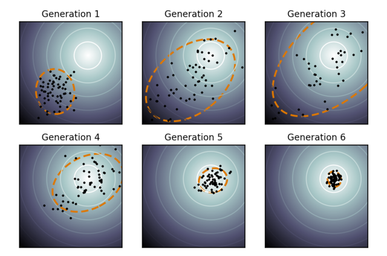

% Introduction to Metaheuristics \newline Estimation of Distribution
% DrC. Alejandro Piad Morffis
% CC-BY - matcom.in/metaheuristics

# Review: The metaheuristic framework

- given a black box function $F$
- define stop criteria
- while not stop do:
  - generate a new solution $x_i$ (or many)
  - evaluate $y_i=F(x_i)$
  - update global best $y^* \leftarrow \min\{y^*, y_i\}$
  - learn something about $F$ for next iteration (maybe)
- return global best $y^*$

# Review: What can we learn...

> - **... in local search?:**
>   - Gradients
>   - Features of local optima
> - **... in evolutionary search:?**
>   - Components of good solutions
> - **... in swarm optimization:?**
>   - Features of the global landscape
>   - Features of local optima

Every metaheuristic learns some implicit **model** of the function
to guide the search.

**Can we make that model explicit?**

# Estimation of Distribution Algorithms

- given a black box function $F$
- **initialize** probabilistic model $\mathfrak{F}$
- define stop criteria
- while not stop do:
  - **sample** $N$ new solutions $\{ x_i \}$ from $\mathfrak{F}$
  - evaluate $\{ y \}_i = \{ F(x_i) \}$
  - update global best $y^* \leftarrow \min\{y^*, y_i...\}$
  - **update** model $\mathfrak{F}$ for next iteration
- return global best $y^*$

\vspace{0.5cm}

**Different EDAs differ in the selection of the model $\mathfrak{F}$**

# Types of models

**What does the model estimates:**

(The distribution of):

- the global optimum
- the local optima
- the best features
- fitness values
- ...

. . .

**What assumptions the model encodes:**

- Are components correlated?
- ...

# PBIL: Genetic algorithms turn EDAs

**Assuming the simplest possible model**

. . .

- A fixed set of binary components $i$
- A binomial distribution for each component $p_i$
- Components are independent

. . .

**Sample:**

- For each component $i$, set $x_i = U(0,1) < p_i$

**Update rule**:

- For each component $i$:
  - compare solutions where $x_i = 0$ vs $x_i = 1$
  - if most soluctions where $x_i = 0$ are better, decrease $p_i$
  - else, increase $p_i$

# PBIL: Genetic algorithms turn EDAs

**Some implementation details:**

- Use a learning rate $r << 1$
- Adjust learning rate to balance exploration/exploitation

. . .

**Extension to categorical distributions**

- For each component $i$:
  - For each value $b_{ij}$,
  - Compute all solutions where $x_i = b_{ij}$
  - Increase $p_{ij}$ proportional to their fitness
- Renormalize probabilities

. . .

**Alternative formulation:**

- Compute marginal distribution from $K$ best solutions
- Interpolate model using learning rate

# UMDA: Moving to continuous spaces

**Model:**

- Each component is a normal distribution $N(\mu_i, \sigma_i)$
- Start with large $\sigma$ values

**Update rule:**

- Computer marginal distribution of best solutions
- Compute $\mu_b,\sigma_b$
- Interpolate

# Removing the independence constraint

**Instead of $N$ independent Gaussian univariate distributions, use a multivariate distribution**

- A vector $\vee$ of $\mu_i$ means
- A matrix $\Sigma$ of $\sigma_{ij}$ covariance pairs

**Update rule:**

- Keep the best $M < N$ solutions
- Update mean
- Update covariance matrix on solution pairs

Better idea: **CMA-ES**

# CMA-ES

Updating the covariance matrix w.r.t. solutions naively is suboptimal. (Why?)

. . .

CMA-ES updates the covariance matrix such that it produces new solutions in the **direction of the best search steps** seen so far.

Details are involved:

- Compute incremental evolution path:
  *If the mean moves in a similar direction, the path length increases.*
- Update step-size $\sigma$ in a similar way.
- Compute covariance matrix.

# CMA-ES

**Adapts much quicker to the function landscape.**

**State-of-the-art in continuous optimization.**

# Towards general-purpose domains

**What happens when the domain is too complex?:**

- Continuous and discrete parameters
- Conditional parameters (hierarchical)

**Example:** Optimizing in the space of computer programs.

- Analytic regression
- Compiler optimization
- AutoML

. . .

\vspace{0.5cm}

**Define the search space with a probabilistic grammar**

# Probabilistic Grammatical Evolution

**Model:**

- Associate probabilities to grammar productions
- Sample in DFS order

**Update rule:**

- Select $K < N$ best solutions
- Compute marginal probability of used productions
- Update model by interpolation

**What is the fundamental problem with PGE?**

You have to evaluate many solutions for a single model update.
For e.g., AutoML, this can be prohitive.

# Bayesian Optimization

**Can we estimate with a single solution?**

. . .

- Assume $F$ can be approximated by, e.g., a mixture of Gaussians
- Bake uncertainty into the sampling process

. . .

**Update rule:**

- Build $\mathfrak{F}$ from previous evaluations
- Construct **acquisition function** $G$
- Find global optimum in $G$

**Examples of acquisition functions:**

- Probability of improvement
- Expected improvement
- Confidence bounds
- ...

# Some conclusions

**Why estimation of distribution works:**

- EDAs are some of the most robust optimization strategies
- Easy to incorporate domain knowledge (e.g., what general shape you expect the function to have)
- Some empirical and formal convergence guarantees

**Other considerations:**

- PBIL / UMDA are simple and good enough for most cases.
- Bayesian Optimization is the fastest when $F$ is very costly.
- **Do not** reimplement CMA-ES! Use a library instead.
- PGE is Turing-complete :)

# Time to practice!

